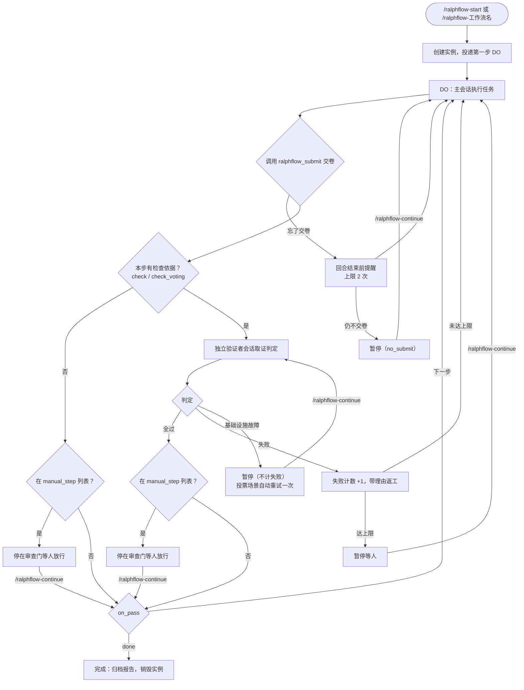
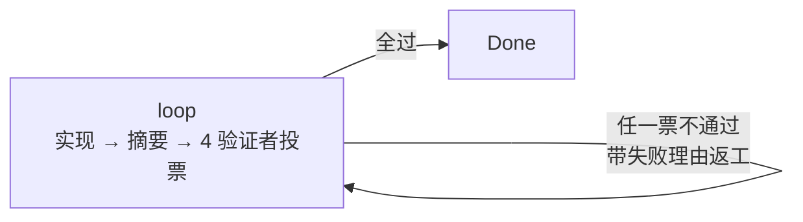
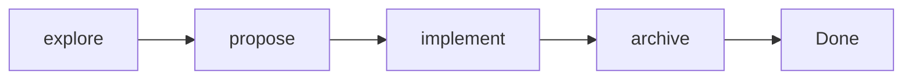

<div align="center">

# ralphflow-dsh

**DeepSeek Harness 工作流自动化插件——把"执行、独立验证、重试"变成插件级强制**

[](https://www.npmjs.com/package/ralphflow-dsh)
[](https://github.com/534529531/ralph-flow-dsh/blob/main/LICENSE)
[](https://github.com/534529531/ralph-flow-dsh)

</div>

---

## 这是什么

你让 AI"实现认证模块、写测试、更新文档、确认全绿"，它常常写了代码就停——测试没跑、文档没写。ralphflow 把这类多步骤承诺变成必须遵循的状态机：**每步做完，由独立的验证会话按检查依据取证判定，通过才放行**。

它不是提示词技巧，是插件级强制。两条中心定理决定了它为什么成立：

> **裁判权在独立会话**——判定只可能产生于一个与执行者互不可见的会话。验证者看不到执行者的自辩，执行者无法转述、伪造、污染判定。
>
> **推进权在机械程序**——是否推进、回退、暂停，只由一段不读模型脸色、不可被说服的程序，根据判定与规则算出。模型可以干活、可以认错，但**不能声称自己通过**。

这是 v2 原生重做版（旧版在 `archive/v1` 分支）。

## 怎么工作的



CHECK 不是同一个会话再问一遍"你做完了吗"。它是一个**全新会话**——没看过 DO 阶段的对话、没有实现上下文、不认识你——只按检查依据判断工作有没有真的完成。AI 对自己的工作过度自信，验证者不会，它要求独立的证据。

`check` 不是必填。步骤不写 `check` / `check_voting` 时，DO 完成后直接按 `on_pass` 推进，不跑对抗验证，也**绝不会写成"检查通过"**——跳过就诚实标注"跳过对抗性验证"。适合文档整理、纯编排这类不需要独立复核的步骤。需要人审的步骤用工作流级 `manual_step`。

## 能力

| 类别 | 能力 |
|------|------|
| 独立验证 | 全新会话的子代理按检查依据取证判定；只读工具白名单；结构化判定 + 文本兜底，**解析失败一律 fail-closed** |
| 多验证者投票 | `check_voting`：1–5 个验证者**并行**独立检查（各自检查依据 / 模型），全过才放行；失败聚合多角度反馈，infra 自动重试一次并只重跑故障票 |
| 检查可选 | 不写 `check` / `check_voting` 就跳过对抗验证，DO 完成后直接走 `on_pass`；`manual_step` 里的这类步骤是纯人工审查 |
| 自动返工 | 判定失败带着**具体理由**回到 `on_fail`——不是盲目重来 |
| 人工审查门 | 工作流级 `manual_step` 列表：先自动验证、通过后停下请你审查，`/ralphflow-continue` 放行（没写 check 时人工审查即最终验证） |
| 上下文重置 | `/ralphflow-reset` 换干净上下文重做当前步；步骤级 `reset: true` / 工作流级 `auto_reset: true` 在步骤边界自动重置；**只换上下文、不赦免失败** |
| 中途回退 | `/ralphflow-rewind <步骤> <原因>` 回退到当前步之前的步骤并换方向：状态机倒退、清暂停与失败计数、原因带进目标步 DO；暂停态也允许 |
| 子工作流 | 一步整段委托给另一个工作流，多层嵌套，通用流程做成可复用资产（加载期静态展开） |
| 多实例并行 | 一个工作区一个引擎；同一工作区多个会话各跑各的实例，互不干扰 |
| 诊断与创建 | `/ralphflow-doctor` 提前抓定义错误与实例体检；`/ralphflow-create` 交互式设计并校验到零告警 |
| 日志与报告 | JSONL 执行日志（含验证者提示词与判定原文）+ 逐步耗时/重试的归档报告 |
| 方言共享 | 同一份工作流 YAML 在 opencode / claude / dsh 三端可跑；本端对"会让资产不再表示它所说的话"的配置一律加载期 fail-fast |

## 快速开始

### 安装

前置：已安装 **dsh**（`@deepseek-ai/dsh-* >= 0.2.0-rc.2`、`cordis >= 4.0.4`）与 **pnpm**（`dsh plugin` 是 pnpm 的转发器）。

```bash
dsh plugin --profile web add ralphflow-dsh
# 或本地路径：dsh plugin --profile web add /path/to/ralph-flow-dsh
```

把 `web` 换成你实际使用的 profile 名，然后**重启 dsh**（重跑 `dsh web`）。

本包是一个 **bundle**（自带 `cordis.patch.yml`），所以上面一条命令就够了：它装上依赖，并把它声明的 row 一并激活——Plugins 页里因此能看到它，也能开关或卸载。**不要去手改 profile 的 `cordis.patch.yml`**：手写的 insert 会和 bundle 自带的那份撞成两份 row。（`2.0.1` 之前的版本还不是 bundle，那时才需要手改；已经手改过的，删掉那段 `- insert:` 与 `- id: ralphflow` 覆盖即可。）

确认装载：在新会话里运行 **`/ralphflow-list`**——应看到内置的 `loop` 与 `spec`，以及你自己的工作流。

### 跑起来

```
/ralphflow-loop "用 JWT + refresh token 实现用户认证模块"
```

工作流自动执行、自动验证、自动推进，绝大多数时间你只需等。需要你出手的只有：人工审查门、以及三类暂停（连续失败 / 基础设施故障 / 忘了交卷的提醒用尽）——都用 `/ralphflow-continue` 放行或恢复。

跑完后报告归档到 `<workspace>/.dsh/ralph-flow/reports/`，交付物在 `.dsh/ralph-flow/artifacts/<产出目录名>/`（两者永久保留）。

> **跑之前确认宿主有委派后端**：验证者需要一个**全新上下文**的子代理后端。若本部署没有（或缺少 persona / 工具白名单能力），验证会以**基础设施故障**暂停（`check_infra`），`/ralphflow-continue` 只会重派、无法让它通过——这时需要先在 dsh 里启用支持该能力的后端。

### 定义你自己的工作流

```yaml
# <workspace>/.dsh/ralph-flow/workflows/my-flow.yaml
description: 实现、测试并文档化一个功能

steps:
  - id: analyze
    desc: 任务分析
    do: 分析需求，产出 design.md
    input: 用户需求
    output: "design.md"
    check: 打开 design.md，核对覆盖数据模型、API、错误处理
    on_pass: execute
    on_fail: analyze
    max_fail_count: 3

  - id: execute
    desc: 实现
    do: 按设计实现，跑全量测试到全绿
    input: design.md
    output: 测试通过的可工作代码
    check: 自己跑测试套件；核对代码与 design.md 一致
    on_pass: done
    on_fail: execute
    max_fail_count: 5
```

`id` 与 `do` 必填（子工作流调用点上 `do` 可选）；此外 `desc` / `input` / `output` / `on_pass` / `on_fail` / `max_fail_count` **六个字段同样必填**（缺失、非字符串、空串都是**加载期硬错误**，整份拒收）。`check` 可选——不写就跳过对抗验证。写完运行 **`/ralphflow-doctor`** 抓出问题。

## 核心概念

**DO → CHECK → 推进。** 每个步骤分两个阶段：

- **DO（主会话）**执行任务，最后调用 `ralphflow_submit` 工具交卷（dsh 原生：工具调用即事实，工具结果结束回合）
- **CHECK（独立会话）**严格对照检查依据取证评判，不和 DO 阶段共享记忆

**交卷是工具调用，不是文本标记。** 不再对模型自由文本做正则匹配——`ralphflow_submit` 的调用是事实。忘了交卷时，回合结束前会收到提醒（上限 2 次），用尽则暂停等你，绝不死循环催促。

**独立验证不是自问自答。** 验证者的后端按**能力**选择（只考虑全新上下文的委派后端，绝不回退到继承父级历史的 `fork`）；身份与职责是插件内部定义，工作流无法配置。它只有只读工具，必须自己看文件、跑命令找证据。**它看不到执行者的交卷摘要**——自述是锚点，会软化独立判定。

**上下文会脏，你能救。** 长工作流跑到后半段，会话里塞满探索、试错、验证记录——模型开始丢需求、跑偏。三种方式解决：

| 场景 | 方式 | 效果 |
|------|------|------|
| 当前步的上下文脏了 | `/ralphflow-reset` | 换干净上下文重做当前步（**不赦免失败**，暂停中拒绝） |
| 前面某步方向错了 | `/ralphflow-rewind <步骤> <原因>` | 状态机倒退到更早的步骤、清暂停与失败计数、原因带进目标步 DO |
| 进入某个重步骤前 | 步骤标 `reset: true` 或工作流级 `auto_reset: true` | 进入该步时自动换干净上下文（含失败重试） |

重置的语义在**所有触发来源下完全一致**（步骤级 / `auto_reset` / 调用点 / 手动 / 回退）：把属主会话的可见面整段替换成一条"交接稿"，模型收到的 messages = 系统提示 + 交接稿 + 本步 DO。**工作流首步的初次进入无法重置**（首步 DO 是启动工具的返回值），启动回执会如实说明。

**随时接管。** 实例属主是状态里的 `owner_session`。`/ralphflow-continue` 在**无属主**时自动接管；有属主时列出候选并要求 `/ralphflow-continue <实例ID>` 显式指定。`/ralphflow-status` 无参且本会话没有活跃实例时，给全部活跃实例的概览（含属主会话）。

## 命令一览

| 命令 | 作用 |
|------|------|
| `/ralphflow-start <工作流> <任务>` | 启动工作流实例 |
| `/ralphflow-continue [实例ID]` | 放行审查门 · 恢复暂停 · 接管实例 |
| `/ralphflow-status [实例ID]` | 当前进度、指定实例详情，或全部活跃实例概览 |
| `/ralphflow-list` | 列出可用工作流 + 活跃实例（只答"现在有什么在跑"） |
| `/ralphflow-cancel [实例ID] [原因]` | 取消并归档报告 |
| `/ralphflow-reset` | 换干净上下文重做当前步（**机械命令**，不注册工具） |
| `/ralphflow-rewind <步骤> <原因>` | 回退到更早的步骤并换方向（**机械命令**，不注册工具） |
| `/ralphflow-doctor` | 诊断工作流定义与实例状态（只报问题与修法，不代你修） |
| `/ralphflow-create [流程想法]` | 交互式设计自定义工作流，校验到全部 ✅ 且无告警 |
| `/ralphflow-<工作流名>` | 动态注册的工作流快捷命令（如 `/ralphflow-loop`、`/ralphflow-spec`） |

命令语义 = **触发词**：`/ralphflow-*` 一律由模型自然语言回复（含用法错误），零程序化卡片返回。两条机械命令是例外——`/ralphflow-reset` 与 `/ralphflow-rewind` 的机械动作由命令处理器直接驱动引擎完成，结果仍交回模型自然语言回复，且**都不给模型可调用的工具**。

## 内置工作流

### loop——多验证者对抗驱动的单步循环

开放式任务、Bug 修复、范围明确的功能开发。一个步骤内完成「实现 → 执行摘要 → 4 个验证者并行投票 → 修复」的迭代闭环，直到全过。

```
/ralphflow-loop "用 JWT + refresh token 实现用户认证模块"
```



前三票逐字对齐 opencode 版（每一条要求都已落实 / 行为符合预期，真实可用 / 没有遗漏的需求，边界情况已覆盖），第 4 票是本仓库的口径「修改不影响原有功能，不破坏需求以外的边界」。标了 `reset: true`：失败返工时换干净上下文，每轮摘要追加到 `summary.md`。`max_fail_count: 100`。想增减验证者，改 `check_voting` 数组即可（1–5 条，写几个就几个）。

### spec——四步开发流水线

需要需求 → 方案 → 实现 → 归档的结构化开发。每步产出后独立验证。

```
/ralphflow-spec "添加 OAuth2 用户认证功能"
```



`propose` 是人工审查门（验证通过后停下等你放行）；`propose` 与 `implement` 标了 `reset: true`，进入时换干净上下文。

> **内置工作流不落盘**（对齐 opencode/claude）：它们只存在于插件目录，加载时回落取用，因此**始终是随插件发布的最新版本**。要定制，就在 `<workspace>/.dsh/ralph-flow/workflows/` 放一个同名文件——它会遮蔽内置（这是唯一的定制入口，也是有意行为）。

## 与 opencode 和 claude 版的关系

同一份工作流 YAML 在三端可跑（`description` / `manual_step` / `adversarial_check` / `auto_reset` / `steps` / `do` / `check` / `check_voting` / `check_model` / `workflow` / `input` / `output` / `on_pass` / `on_fail` / `max_fail_count` / `reset`）。dsh 是方言基准，**载体按 dsh 原生件重新组合，不移植任何一家的引擎**。读者需要知道的几处刻意差异：

| 主题 | opencode / claude 版 | 本端（dsh） |
|------|---------------------|-------------|
| DO 交卷 | 输出 `<promise>done</promise>` 文本标记，由 idle 驱动正则检测 | **调用 `ralphflow_submit` 工具**（工具调用即事实）；忘了交卷由 `agent/turn-stopping` 提醒，上限 2 次 |
| 验证超时 | `adversarial_check.timeout_ms` | **不设**：委派生命周期交给宿主 dsh 的原生看门狗；写了该键是加载期告警 + 忽略 |
| 验证者额外可读目录 | `extra_dirs` | **不存在对应物**：子代理继承发起会话的工作区与权限面，权限是宿主的职责 |
| 子工作流 | 运行期状态栈，最多 5 层 | **加载期静态展开**，步骤总数上限 2000、嵌套深度上限 32；零新增实例状态字段 |
| 步骤级 `manual_step` | 只是不认识的步骤键，被警告忽略（门静默消失） | **加载期硬错误**，文案给出顶层列表的正确写法 |
| 六个步骤字段 | 缺失就 `skipStep`（静默丢步） | **加载期硬错误**，整份拒收 |
| 换会话载体 | 可选物理新开终端窗口（`isNewOpen`） | 应用内整段替换属主会话可见面（无新窗口） |

本端对"会让资产不再表示它所说的话"的配置一律 **fail-fast**；对"自己不兑现的键"一律 **告警 + 忽略 + 指路**，绝不静默生效、也绝不改作别的含义。

## 文档

| 想了解 | 看这个 |
|--------|--------|
| 创建自己的工作流（YAML 字段、check 可选、重置门、回退、嵌套、多验证者投票） | [自定义工作流指南](https://github.com/534529531/ralph-flow-dsh/blob/main/docs/custom-workflows.md) |
| 架构、状态模型、独立验证、生命周期、工作区锚定 | [工作原理](https://github.com/534529531/ralph-flow-dsh/blob/main/docs/how-it-works.md) |
| 所有命令、工具、日志事件、实例目录结构 | [命令参考](https://github.com/534529531/ralph-flow-dsh/blob/main/docs/commands.md) |
| 完整导航（阅读顺序、场景速查、设计档案索引） | [文档主页](https://github.com/534529531/ralph-flow-dsh/blob/main/docs/README.md) |
| 设计定稿与宪法（不可违反的十二条） | [设计文档](https://github.com/534529531/ralph-flow-dsh/blob/main/docs/v2/design.md) |
| 历史任务书与验收证据 | [docs/v2/](https://github.com/534529531/ralph-flow-dsh/tree/main/docs/v2) |

## 致谢

ralphflow 的名字和核心理念（执行 → 验证 → 重试）来自 [ralph-loop](https://github.com/charfeng1/opencode-ralph-loop) 提示词模板。内置的 `loop` 工作流是其工作流化实现，`spec` 受 [OpenSpec](https://github.com/Fission-AI/OpenSpec) 启发重新设计。

姊妹实现：[opencode 版](https://github.com/534529531/ralph-flow)（`@yibener/ralph-flow`）与 claude code 版。多步骤状态机、独立验证、重置门等架构经验从 gsd2（现 [gsd-pi](https://github.com/open-gsd/gsd-pi)）吸取了大量工程教训。

与 ralph-loop 的关键差异：ralphflow 是插件级状态机而非提示词——具备独立验证（不依赖"自己审查自己"）、多步骤流水线、暂停/恢复、中途回退、可组合子工作流和完整日志记录。

## 许可

[MIT](https://github.com/534529531/ralph-flow-dsh/blob/main/LICENSE)

---

<div align="center">

MIT · [GitHub](https://github.com/534529531/ralph-flow-dsh) · [npm](https://www.npmjs.com/package/ralphflow-dsh)

</div>
