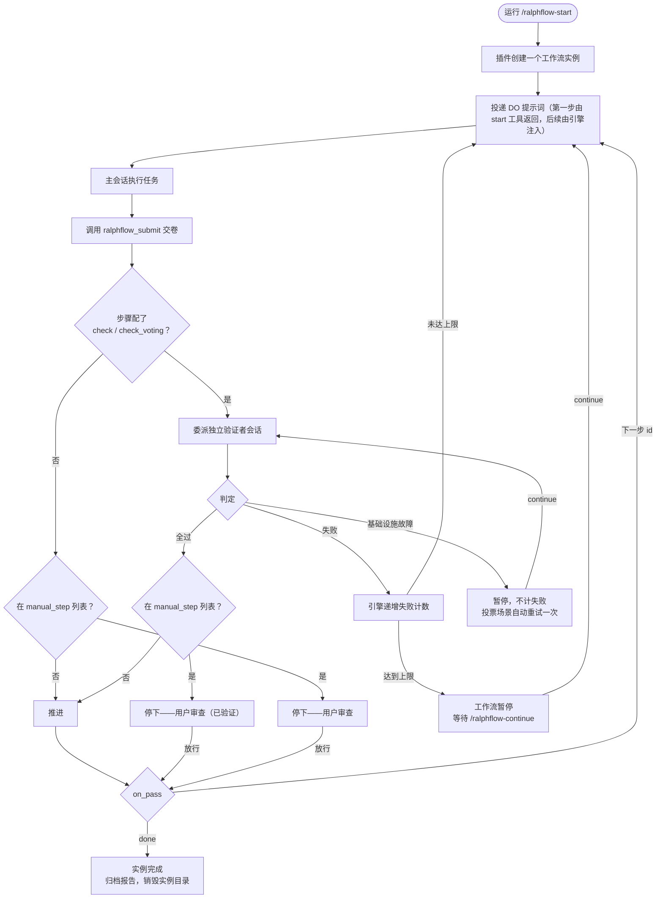

# 工作原理

本文档解释 ralphflow-dsh 的内部工作机制，以及几个反直觉设计背后的理由。

---

## 核心循环

每个工作流都遵循同一个基本循环：



普通步骤的验证是**自动**的：交卷后引擎自动拉起验证者，模型不需要调用 `ralphflow_continue`。`ralphflow_continue` 只用于批准审查门、恢复暂停、接管实例。

---

## 阶段细节

**DO 阶段**（主会话）：

1. 引擎投递步骤的 DO 提示词（第一步由 `ralphflow_start` 工具返回，后续步骤由引擎在步骤边界注入）。提示词含 `## 任务` / `## 本步要做什么` / `## 产出目录` / `## 交付物`（返工时另加失败理由段，回退时另加回退原因段）。
2. 主会话执行任务（写代码、跑命令、产出指定输出）。
3. 完成后**调用 `ralphflow_submit` 工具**交卷——工具调用是事实，工具结果带 `concludesTurn` 由机器结束回合。**不再对模型自由文本做正则匹配。**
4. 忘了交卷的兜底：`agent/turn-stopping`（dsh 原生、serial、可 await，等价于 claude/opencode 的 Stop hook）在回合关闭前检查「有活跃实例 / 本步未交卷 / 无在飞委派」，是则以 `agent.steer` 提醒调用 `ralphflow_submit`；提醒次数按"本次进入该步"起算，**上限 2 次**，用尽则暂停（`no_submit`）等你，绝不死循环催促。

**CHECK 阶段**（独立会话，仅本步有检查依据时）：

1. 引擎按能力选择后端，拉起一个**全新会话**的验证者子代理。
2. 验证者自主探索工作区，按检查依据取证评估——它完全没看过 DO 阶段的对话。
3. 判定经程序通道返回：优先原生结构化输出（`structured_output`），provider 不支持时降级为 `<promise-check>true|false</promise-check>` 文本标签。
4. 引擎处理判定：要么推进（`on_pass`），要么带失败理由返工（`on_fail`）。
5. 进度播报（「验证者 i/N 通过 / 不通过」、判定结论、暂停/完成告知）**直接落在会话时间线上**（你马上看得到），但**不会唤醒本会话**——空闲的保持空闲，正在收尾的回合也不会被续上。只有「要模型干活」的指令（下一步 DO、要转达的话、交卷提醒）才唤醒驱动器。分类台账见 [投递分类台账](https://github.com/534529531/ralph-flow-dsh/blob/main/docs/v2/delivery-classification.md)。

**跳过验证**：步骤不写 `check` / `check_voting` 时，交卷后直接按 `on_pass` 推进，不创建验证会话，轨迹与报告显示"跳过对抗性验证"。`manual_step` 列表里的这类步骤是纯人工审查（交卷即停）。

---

## 裁判权定理

ralphflow 为什么成立，只有两句话：

> **T1 · 裁判权在独立会话**——判定只可能产生于一个与执行者互不可见的会话。它看不到执行者的自我辩护；判定经程序通道（结构化契约）返回；执行者无法转述、伪造、污染判定。
>
> **T2 · 推进的决定权在机械程序**——是否推进、回退、暂停，只由一段不读模型脸色、不可被说服的程序，根据判定与规则算出。模型可以干活、可以认错，但**不能声称自己通过**。

两条推论（写死，防误读）：

- **独立性 = 会话隔离 + 程序守卫，不是模型隔离。** 验证者默认与主会话同模型——对抗性来自"它看不到主会话的自辩"，不来自"换了更强的模型"。
- **审查门不是人的特权，是程序的规则。** 门是状态机的一等推进语义：程序判定通过后，若该步骤声明门，放行的唯一入口仍是程序（fail-closed）。

---

## 独立会话验证

### 后端按能力选择，不按名字

验证者后端属于插件**内部**，工作流没有任何入口影响它。选择规则：

1. 只考虑 `inheritsParentContext === false` 的 provider（全新上下文）——**绝不**回退到继承父级历史的 `fork`（那会让 T1 静默失效）；未声明该字段的同样不选（fail-closed）。
2. 候选里优先 `capabilities.persona && capabilities.toolFilter` 都支持的（这是"独立 + 有纪律的只读裁判"的前置条件）。
3. 一个都没有 → 记 `infra`，理由写明缺哪个能力或"本部署没有全新上下文的委派后端"，**绝不生成通过判定**。

### 身份是内部定义

验证者的职责（独立性、只读取证、不采信自述、默认不通过）收敛为插件内的固定 persona，经 dsh 原生子代理的 `persona` 通道传入。工作流的 `check` 因此**只写判据与事实，不写角色设定**。

### 只读约束

验证者的工具白名单是 `read` / `grep` / `glob` / `bash` / `read_image`。`bash` 内的间接写（`sed -i` / `tee`）**有意接受**——真正能挡住篡改的是工具白名单 + persona 的行为约束；把 bash 白名单化覆盖不全生态（pnpm/bun/mvn/mix…），而且它根本防不住 `npm test` 里跑的脚本。将来用 dsh 沙箱收紧。

### 判定 fail-closed

判定解析顺序：结构化输出 → `<promise-check>` 文本 → JSON 兜底 → **都没有 = `infra`**。任何解析失败都绝不 passed。

### 验证者看不到执行者的自述（T1 硬规则）

验证者只判"结果是否满足检查依据"，不判"执行者怎么做的、自称做了什么"。自述是**锚点**，会软化独立判定。交卷摘要仍存于状态里，但**唯一消费者是审查门改稿重交去重**，不流向验证者。

### 模型优先级链

```
check_voting 条目 model  >  步骤 check_model  >  全局 adversarial_check.model  >  发起会话当前模型
```

模型通过 dsh 原生的 `agentOptions` 传给验证者，不由提示词要求模型自行切换。**没有覆盖时不传 `agentOptions`**，由宿主继承发起会话当前模型。裸模型名、对象缺字段、类型非法 → 告警并回退，绝不静默忽略。

### 基础设施故障 ≠ 工作故障

验证会话跑不起来（API 错误、后端缺能力、判定解析失败）**不能**说明工作成果的质量。引擎不把它计入步骤失败，也不让主会话回去重做已完成的工作：它在 CHECK 阶段暂停（`check_infra`），下一次 `/ralphflow-continue` **只**重跑验证。投票场景下 infra 会先自动重试一次，且只重跑故障票。

---

## 状态模型

每个实例的状态存放在 `instances/<实例ID>/state.json`（原子写：临时文件 + rename）：

```json
{
  "active": true,
  "workflow_name": "loop",
  "current_step": "loop",
  "user_task": "...",
  "fail_counts": { "loop": 0 },
  "paused": false,
  "pause_reason": null,
  "do_submitted": true,
  "owner_session": "<属主会话 id>",
  "last_submit_summary": null,
  "artifacts_dir_name": "修复登录空指针-49lo",
  "delegations": [],
  "verdicts": [],
  "history": [],
  "started_at": "...",
  "updated_at": "..."
}
```

**不存相位**：所有阶段都是派生量（交卷了吗 / 判定落地了吗 / 有在飞委派吗 / 暂停了吗），由原始事实现算。存了就有两个写入者——这是 v1 的 34 处文件标记位留下的教训。

**不存派生量**：`fail_count` 读时由 `fail_counts[current_step]` 现算，落盘前剔除；`stepStats`（每步耗时/重试）、投票进度、审查门归属全部现算。

**审查门不是状态字段**：`manual_step` 是工作流定义的属性，门开没开由"当前步是否在列表里 + 判定是否齐"现算。子工作流静态展开后没有栈帧，所以没有标记要清。

---

## 推进规则

引擎唯一的决策点（`ralphflow_continue` 与自动推进都走这里），一律 **fail-closed**：

| 条件 | 引擎做什么 |
|------|------------|
| **定义已声明免验证**（`check` / `check_voting` 都不写） | 不委派验证者、不写判定：非门 → 交卷即按 `on_pass` 推进；门 → 交卷即停在门状态等 `continue` |
| 判定齐且全 `passed` | 若当前步在工作流级 `manual_step` 列表里 → 停在门状态等 `continue`；否则按 `on_pass` 推进 |
| 任一条 `failed` | 按 `on_fail` 回退，失败计数 +1；未达上限 → 恢复 DO 等待重做；达上限 → 暂停 |
| 任一条 `infra` | 暂停（`check_infra`），**不烧失败计数** |
| 判定全 passed 但有条目属于**别的步骤** | 拒绝推进（过旧/外来判定复用是明确的攻击向量） |
| 有判定但未全过 | 拒绝，**不烧失败计数**（模型修好重新交卷即可） |
| 已交卷无判定 | 重新委派验证 |
| 未交卷 | 拒绝（"本步配置了检查依据，没有判定不能推进"） |
| 用户 cancel | 中止在飞验证者，归档报告，`user_cancelled` |

**为什么"无检查依据即推进"仍是 fail-closed**：决策输入是**工作流定义**（作者所有），不是执行者——执行者在运行期无法影响它。故这是"作者声明的机械推进"，不是执行者绕过裁判。同类先例：审查门的放行本就是"无机器判定即推进"（由人决定）。

---

## 崩溃恢复与心跳

引擎绝不隐式推进——**无人驱动 = 暂停等用户**。

- 属主在等待判定期间，每 **5 秒**刷新在飞委派的 `heartbeat_at`；判活阈值 **60 秒**。
- 插件重载时扫描实例：**心跳仍新鲜**的委派一律不动（另一个进程/实例可能正持有它）；**心跳已停**（或无心跳字段的老状态）的委派判为孤儿 → 判定作废、暂停 `check_infra`、清空委派，记 `orphan_delegation_recovered`。
- 迟到的验证回调由"实例状态已不存在"护栏挡下（`verdict_discarded`），**销毁后不再写状态**（否则 `writeState` 会把实例目录 `mkdir` 复活）。

---

## 人工审查门

工作流级 `manual_step` 列表里的步骤在 **CHECK 通过后**暂停。引擎和普通步骤一样先自动运行独立验证；通过后它**不**直接推进，而是停下会话，让你审查**已验证的产物**。你的 `/ralphflow-continue` 是放行——直接按 `on_pass` 推进（该步骤未配置检查依据时，人工审查即最终验证）。

判定失败走 `on_fail` 自动重试，不打扰你；你要改，会话就改并再次交卷，自动重新验证，通过后再停下等你。

**门的判据**是"本步在工作流级 `manual_step` 列表里"（工作流定义的属性），且（无检查依据 **或** 判定齐且全 passed）。执行者在运行期无法影响它。

---

## 子工作流：加载期静态展开

一步可以用 `workflow:` 委托给另一个工作流。本端**不用** opencode 的运行期状态栈，而是在**加载期**把调用点就地替换成子工作流的步骤：

- 子步骤 id = `调用点id/子步骤id`（多层继续叠加）；子工作流的出口接到调用点的 `on_pass`。
- 运行期"嵌套"不可见：`current_step` 仍是单字符串、失败预算仍按步记账、审查门与验证者全按普通步骤走，**零新增实例状态字段**。
- 展开是**复制**：同一子工作流被 N 个调用点引用就展开 N 份。
- 上限：展开后步骤总数 **2000**、嵌套深度 **32**（含最外层）。深度闸在展开任何一层之前拒绝，避免宿主调用栈被打爆（步数上限看不见"每层只有调用点"的长链）。
- 它静默忽略或拖到运行期才炸的（成环、子文件加载不出、id 撞名、id 含 `/`）一律**加载期硬错误**。
- 子步骤耗尽 `max_fail_count` → **暂停等人**（不做"自动走父级 `on_fail`"）。
- 子文件的 `adversarial_check.model` 下沉到各步 `check_model`（逐层回退父级）；调用点的 `do` 下沉到子步骤的「任务」（最内层优先、外层继承）。

设计权衡见[自定义工作流 → 子工作流与嵌套](custom-workflows.md#子工作流与嵌套)。

---

## 中途回退与上下文重置

`on_pass` / `on_fail` 是工作流**作者**预设的静态路由——只有当判定失败时引擎才按图跳。三个常用的运行时场景都不依赖它：

| 场景 | 命令 | 状态机 | 计数 | 换上下文 | 原因 |
|------|------|--------|------|----------|------|
| 当前步上下文脏了想原地重来 | `/ralphflow-reset` | 不动（停当前步） | **保留**——不赦免，自动刹车仍然真 | 是 | — |
| 后期发现前面某步方向错了，要回去重做 | `/ralphflow-rewind <步骤> <原因>` | 倒退到当前步之前的步骤 | 清空 + 清暂停 | 是 | **必填**，写进目标步 DO |
| 进入重步骤前自动切一刀 | 步骤 `reset: true` / 工作流 `auto_reset: true` | 不动 | 保留 | 是 | — |
| 整个推倒重来 | `/ralphflow-cancel` + `/ralphflow-start` | 销毁实例 | — | — | — |

**换上下文的机制**：在步骤边界的空闲窗口（`agent.runMaintenance`，phase ≠ idle 即放弃），把属主会话可见面的 `nodes[1]` 到末尾**整段替换**成一条插件写的「交接稿」，使模型收到的 messages = **系统提示 + 交接稿 + 本步 DO**。节点 0（系统提示）**永不覆盖**；替换前做 `toolPairingBalancedAfter` 自检，面不平衡就放弃本次替换（DO 照常投递并说明原因）。用的是插件自有的消息来源标记，**不冒用压缩检查点、不发任何 `compaction/*` 事件**。

**首步无法重置**：首步 DO 是 `ralphflow_start` 工具的返回值，在工具调用内部替换会静默损坏会话（孤儿 `tool/result`）。启动回执如实说明；**失败重试时会正常重置**。

**为什么手动 reset 不赦免失败**：否则反复 reset 就能绕过 `max_fail_count`。想清零失败预算，走「暂停 → `/ralphflow-continue`」这条显式赦免路径。

**为什么 rewind 允许暂停态**：很多用户正是发现卡死之后才决定换个方向重来。判据是 `do_submitted === false`，**不是** `paused`——`max_failures` / `check_infra` 的暂停会留下 `do_submitted=true` 的残留，而暂停本身就意味着机械程序已把该轮收尾。未暂停 + 已交卷 = 验证在飞 / 审查门已开，一律拒绝（回退会把判定变成孤儿）。

---

## 多实例与工作区锚定

- **一个工作区一个引擎**（对齐 opencode 的"每个项目目录一个插件实例"）：引擎的根就是**发起会话的工作区**，所以列表、历史、`doctor`、自定义工作流查找全都落在同一个地方。工作区之间互相独立、互不可见。
- **没有全局索引**——任何跨工作区的映射都会让"写入看会话工作区、读取看进程 cwd"这类缺陷复活（引擎的进程 cwd 与真实 GUI 里的会话工作区必然不同）。
- 每次 `ralphflow_start` 创建一个隔离实例；一个会话最多驱动一个实例，多个会话各驱动各的。
- 属主是状态里的 `owner_session`；接管口径见[命令参考 → 实例模型](commands.md#实例模型)。

---

## 会话事件

插件挂接 dsh 的会话事件来驱动工作流：

| 事件 | 触发时机 | 动作 |
|------|----------|------|
| `agent/turn-stopping` | 回合即将结束 | 检查"本步未交卷且无在飞委派"→ 提醒交卷（上限 2 次） |
| `session/event`（`assistant/message`） | 助手输出消息 | 记录助手文本，供审查门改稿重交去重 |
| `session/created` | 新会话创建 | 按其工作区补登记动态工作流快捷**技能**（`/ralphflow-<工作流>`） |

所有投递给用户的播报都带 `form: "notice"` + 非空 summary，客户端据此渲染折叠行——**用户可见性与消息来源 kind 无关**。

---

## 实例生命周期

活跃实例与历史分两层：**实例是临时的，报告与产出是永久的。**

完成/取消时严格按序执行：

1. **先归档报告** `reports/<实例ID>.md`；失败则**中止销毁**（保留可见残留 + 告警，绝不静默丢轨迹）。
2. 归档执行日志到 `reports/<实例ID>-execution.log`（失败只告警、不阻塞销毁——报告是主事实、日志是辅助证据）。
3. 把全部路径解析并固定（产出目录名只存在于状态里，删掉就查不到了）。
4. **先除名**（`unlink(state.json)`）**后删物理文件**（否则部分删除失败会留下幽灵实例）。
5. 递归删实例目录；非递归 `rmdir` 产出目录（**非空即保留**——真实交付物永远活得比实例久）。
6. **复查**实例目录是否真的没了，没删掉就记下来并让完成/取消播报**如实说残留**、指向 `doctor`（绝不谎称"已销毁"）。

`writeState` 会 `mkdirSync` 实例目录，因此**销毁后不得再写状态**。

---

## 日志

每实例事件记录到 `instances/<实例ID>/execution.log`，JSON Lines 格式（10 MB 轮转、保留 3 份）：

```jsonl
{"ts":"...","level":"info","event":"start","instId":"loop-...-ab12","workflow":"loop"}
{"ts":"...","level":"info","event":"step_start","instId":"loop-...-ab12","step":"loop"}
{"ts":"...","level":"info","event":"do_submitted","instId":"loop-...-ab12","step":"loop"}
{"ts":"...","level":"info","event":"verdict_passed","instId":"loop-...-ab12","step":"loop"}
{"ts":"...","level":"info","event":"complete","instId":"loop-...-ab12"}
```

日志是 append-only 的**文件事实**，不是状态——`state.json` 一个字节都不因它改变。事件清单见[命令参考 → 事件一览](commands.md#事件一览)。

---

## 目录结构

```
<workspace>/.dsh/ralph-flow/
├── workflows/          # 本工作区自定义工作流（最高优先级）
├── instances/<实例ID>/  # 活跃实例：state.json + execution.log（结束时销毁）
├── reports/            # 完成/取消后归档（永久）
└── artifacts/<产出目录名>/  # 每实例隔离的交付物（永久；只有空目录会随实例销毁）
```

工作流解析顺序是**工作区 → 全局（`~/.dsh/ralph-flow/workflows/`，`DSH_HOME` 为绝对路径时以它为准）→ 插件内置**。内置工作流从插件自己的目录解析，因此始终反映已安装版本——绝不拷贝进工作区或全局目录（拷贝会导致过期）。工作区或全局目录里的同名工作流会遮蔽下层。

---

## 设计原则（宪法摘要）

完整设计、十二条宪法与版本路线图见[设计定稿与宪法](v2/design.md)。对外可见的几条：

1. **裁判权只在独立会话**（T1）。主会话任何路径都不得影响判定内容与判定产生过程。
2. **推进只由机械程序决定**（T2）。`continue` 类入口一律 fail-closed 读程序持有的判定。
3. **引擎是唯一写入者**。事件监听只宣告与记账，不写状态迁移。
4. **状态不存派生量**。无相位、无文件标记位。
5. **判定 fail-closed**。解析失败/结构校验失败 = 基础设施故障或打回，绝无默认通过。
6. **主会话永远不委派验证者**。委派只从引擎发出。
7. **不移植 opencode/claude 引擎**。只移植"裁判权在程序"语义与用户旅程，机制用 dsh 原生件组合。
8. **不支持的方言键 = 警告忽略，不兼容、不加工作量**；但会让资产不再表示它所说的话的配置 = 加载期硬错误。
